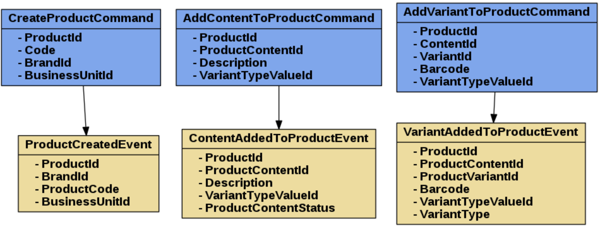

# ProductContext-EventSourcing

A practical/experimental Event Sourcing application on Product Bounded Context in an e-commerce

# Purpose

I wanted to implement what i learnt about DDD CQRS and EventSourcing, that's why i created this repository. I will add new things to here by time as i learn.

# Dependencies

* Docker
* [EventStore](https://eventstore.org/)
* [Couchbase](https://www.couchbase.com/) for query side

**EventStore** and **Docker** will be organized by `docker-compose.yml`

# Libraries

* [AggregateSource](https://github.com/yreynhout/AggregateSource) for base structure of **AggregateRoots** and **Entities**
* [Value](https://github.com/tpierrain/Value) for **value objects**
* [MediatR](https://github.com/jbogard/MediatR) for seperating **command** and **queries**
* [Projac](https://github.com/BitTacklr/Projac) for **projections**
* [LibLog](https://github.com/damianh/LibLog) for logging

# How

Repository contains a `docker-compose.yml` file which provides all dependencies for bootstrapping and developing. 

`docker-compose up`

You can run tests afterwards.

# Domain Model

[StoryStream](https://app.getstorystream.com/) is used for Event Storming while modeling domain model. 

Domain model basically provides a Product which has a Color (Content) and it's Variants.

 
 
# Project Structure

Solution has 3 main projects. These projects are:

* ProductContext.WebApi
* ProductContext.Domain
* ProductContext.Framework

## ProductContext.WebApi

* Uses [Swagger](https://github.com/domaindrivendev/Swashbuckle) for documentation
* Has a `ProductCommandsApi` as controller
* Uses `Mediator` for sending commands to handler

## ProductContext.Domain

* `Events` and `Commands` sit here.
 
| AggregateRoot | Entities      | ValueObjects  |Documents|
| ------------- |:-------------:|:-----:|:----:|
| Product    | ProductContent | ProductContentId|ProductContentDocument|
|| ProductVariant | ProductVariantId|ProductVariantDocument|
|||ProductId| ProductDocument |
|||ProductContentVariantValue|
|||ProductVariantTypeValue|
|VariantTypeValue||VariantTypeValueId|*Not yet implemented*|

`Product` is a **Snapshotable** aggregate root.

## ProductContext.Framework

* Snapshotting with `AsyncSnapshotableRepository<TAggregateRoot>`
* Tracking last projection status with `CouchbaseCheckpointStore`
* `Now`, `GetStreamName`, `GetSnapshotStreamName` delegates for creating proper stream Ids
* `ProjectionManager` runs the Projections and every event fall into Projac projection handler.

# Deploy

* Kubernetes
	* `minikube start`
	* `eval $(minikube docker-env)` switch to kubernetes local registry your current terminal context
	* `docker ps #see what's going on kubernetes local registry`
	* `docker build -t productcontextes .`

* Helm
	* Switch to `/deployments`
	* `helm package productcontext --debug`
	* `helm install productcontext`

	

# To Be Implemented

* Correlation/Causation Id

# Notes

What brings you here of course not unique. I inspired a lot from [WorkshopEventSourcing](https://github.com/UbiquitousAS/WorkshopEventSourcing)